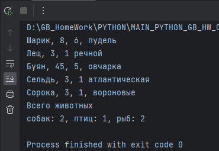

# Погружение в Python. ООП. Начало

# Задача 1
Доработаем задачи 5-6. Создайте класс-фабрику.
Класс принимает тип животного (название одного из созданных классов) и параметры для этого типа.
Внутри класса создайте экземпляр на основе переданного типа и верните его из класса-фабрики.

Пакет **animals** - пакет классов задачи. 

**Пример выполнения**

# Задача 2
Возьмите 1-3 любые задачи из прошлых семинаров (например сериализация данных), которые вы уже решали. 
Превратите функции в методы класса, а параметры в свойства. Задачи должны решаться через вызов методов экземпляра.

